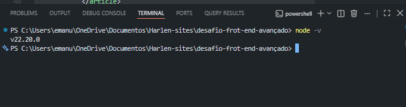
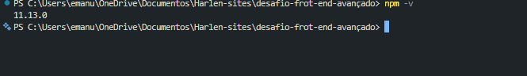

# 💼 Leque de Vagas

Projeto desenvolvido durante as aulas de Next.js com o objetivo de criar uma plataforma de vagas de tecnologia voltada para pessoas em transição de carreira.

## 🚀 Tecnologias

- Next.js 16
- React 19
- TypeScript
- CSS
- Vercel

## 📂 Estrutura

```text
leque-de-vagas/
├── app/
│   ├── contato/page.tsx
│   ├── sobre/page.tsx
│   ├── globals.css
│   ├── layout.tsx
│   └── page.tsx
├── components/
│   ├── Beneficios.tsx
│   ├── BuscaVagas.tsx
│   ├── Cabecalho.tsx
│   ├── ComoFunciona.tsx
│   ├── Conteudos.tsx
│   ├── CTA.tsx
│   ├── Hero.tsx
│   ├── Icone.tsx
│   ├── Marca.tsx
│   ├── Rodape.tsx
│   └── VagasDestaque.tsx
├── public/
├── package.json
└── README.md
```

## 💻 Como executar

Primeiro, instale as dependências:

```bash
npm install
```

Depois, inicie o ambiente de desenvolvimento com Turbopack:

```bash
npm run dev
```

Abra [http://localhost:3000](http://localhost:3000) no navegador.

Para conferir a versão de produção:

```bash
npm run build
npm start
```

## 🌐 Deploy

🔗 Site: ADICIONAR_LINK_VERCEL

🔗 Repositório: [github.com/Harlen539/front-end-avancado](https://github.com/Harlen539/front-end-avancado)

## 📸 Ambiente de desenvolvimento

### Node.js



### npm



## 🧠 O que aprendi

Este espaço pode ser atualizado ao final do semestre com os principais aprendizados obtidos durante o desenvolvimento.

## 🧠 O que é um componente?

> TODO: Harlen — escrever aqui com minhas próprias palavras o que entendi sobre componentes e por que reutilizar o Cabecalho é melhor do que copiar o mesmo código em todas as páginas.

## 🔗 Navegação com Link

> TODO: escrever com minhas próprias palavras o que observei ao comparar o `<Link>` do Next.js com uma navegação tradicional.

## 💭 Maior dificuldade

> TODO: escrever após finalizar o desafio.

## 👥 Equipe

- Harlen Henrick Galdino do Nascimento
- Bruno Venâncio Soares
- Carlos Eduardo Gomes Filho
